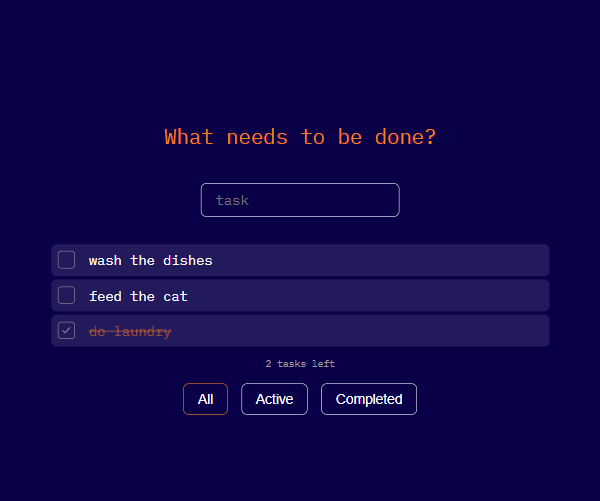
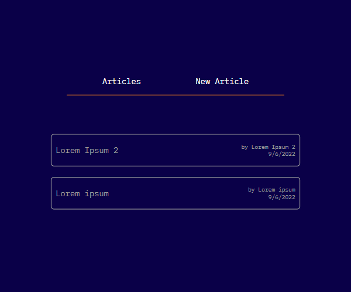
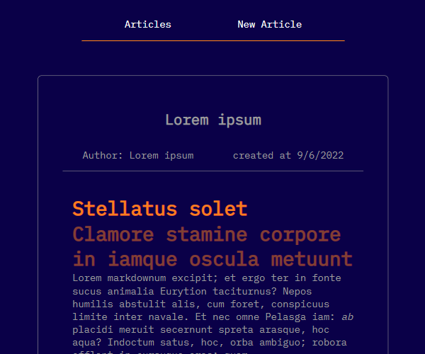
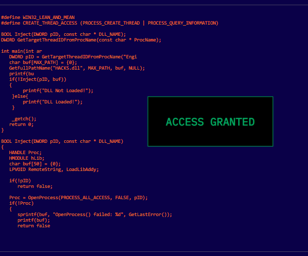
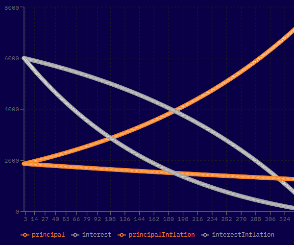

# ITA 2022 React Practice

Clone the repository to get started.

## [](#clone-repository)Clone

```
git clone https://github.com/Katarca/ITA-2022
```

### [](#install)Install

```
npm install
```

### [](#start)Start

```
npm run start
```

## [](#react-apps)React Apps

### [](#javascript-web)JavaScript Web

[JS web](https://github.com/Katarca/ITA-2022/tree/main/src/javascript-web)

A simple static web page about JavaScript's origin.


### [](#todo-list)ToDo List

[ToDo List](https://github.com/Katarca/ITA-2022/tree/main/src/todo-list)

A simple application that allows you to add, edit, delete and filter your daily tasks, which are saved in local storage.



### [](#todo-list-redux)ToDo List Redux

[ToDo List Redux](https://github.com/Katarca/ITA-2022/tree/main/src/todo-list-redux)

Redux version of ToDo List app.


### [](#blog)Blog

[Blog](https://github.com/Katarca/ITA-2022/tree/main/src/blog)

A blog application that allows you to write, edit and delete articles in markdown. Articles are saved in local storage.



### [](#blog-post-app)Blog Post App

[Blog Post App](https://github.com/Katarca/ITA-2022/tree/main/src/blog-post-app)

A version of blog application with backend file system.



### [](#hacker-typer)Hacker Typer Clone

[Hacker Typer](https://github.com/Katarca/ITA-2022/tree/main/src/hacker-typer)

A clone of [hacker typer](https://hackertyper.com/).



### [](#memory-game)Memory Game

[Memory Game](https://github.com/Katarca/ITA-2022/tree/main/src/memory-game)

A simple game built to test a users memory.


### [](#mortgage-calculator)Mortgage Calculator

[Mortgage Calculator](https://github.com/Katarca/ITA-2022/tree/main/src/mortgage-calculator)

An application that calculates monthly payments, remain balance, interest and principal paid of mortgage.



### [](#tic-tac-toe)Tic Tac Toe

[Mortgage Calculator](https://github.com/Katarca/ITA-2022/tree/main/src/tic-tac-toe)

A simple tic tac toe game for two players.


